# Gytha — Netrek Client (Pygame)

Gytha is a Python/Pygame client for [Netrek](https://www.netrek.org/), a real-time
multiplayer space combat game first played in 1988.  It connects to any standard
Netrek server over TCP/UDP.

**Version:** 0.9  
**Author:** James Cameron &lt;quozl@us.netrek.org&gt;  
**Licence:** GNU General Public Licence v2 (see `COPYING`)  
**Language:** Python 3, Pygame 2.6.1+

---

## About Netrek

Netrek is a 16-player real-time space battle game.  Two teams of up to eight
ships fight for control of planets across a 100,000 × 100,000 coordinate galaxy.

Your team starts with ten planets.  Each player flies a starship.  You shoot at
enemy ships with torpedoes and phasers.  You fly to, scan, and bomb enemy planets
to deny their use by the enemy team.  You protect your own planets by preventing
the enemy from reaching them.

Once you make a kill and don't die, you beam up armies from the planets you
protected and drop them on enemy planets that have been bombed.

Your team wins when all the enemy planets are taken.  Your team loses if all your
planets are taken.  Strategies include escorting, controlling space, and
coordinated attacks.

## Features

- Tactical view (your ship centred, 20,000-unit radius) and simultaneous galactic
  overview
- TCP and UDP protocol support with automatic upgrade after login
- Metaserver integration — queries `metaserver.netrek.org` on startup for a live
  server list
- Animated sprites: rotating ships, exploding torpedoes, phaser lines, tractor
  beams, shield bubbles, planet halos
- Structured distress / RCD (Receiver Configurable Distress) team-chat parsing
- Achievement system persisted to `~/.gytha.achievements`
- Mercenary auto-team-selection mode
- Fullscreen and windowed modes; Scale2x for high-DPI displays
- OGG sound effects (kills, death, phaser, shields, gains)
- Screenshots via the Print Screen key

---

## Screenshots

### Splash

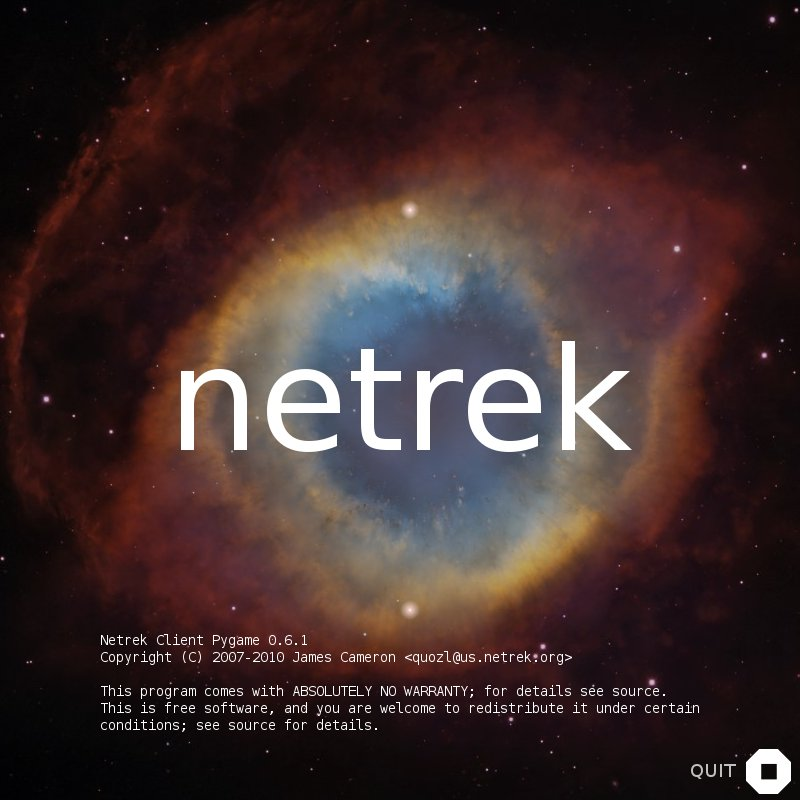

A splash screen showing the game name, licence, and a rotating icon.  During
this time the imagery pipeline is initialised and graphical assets are loaded.

---

### Server List

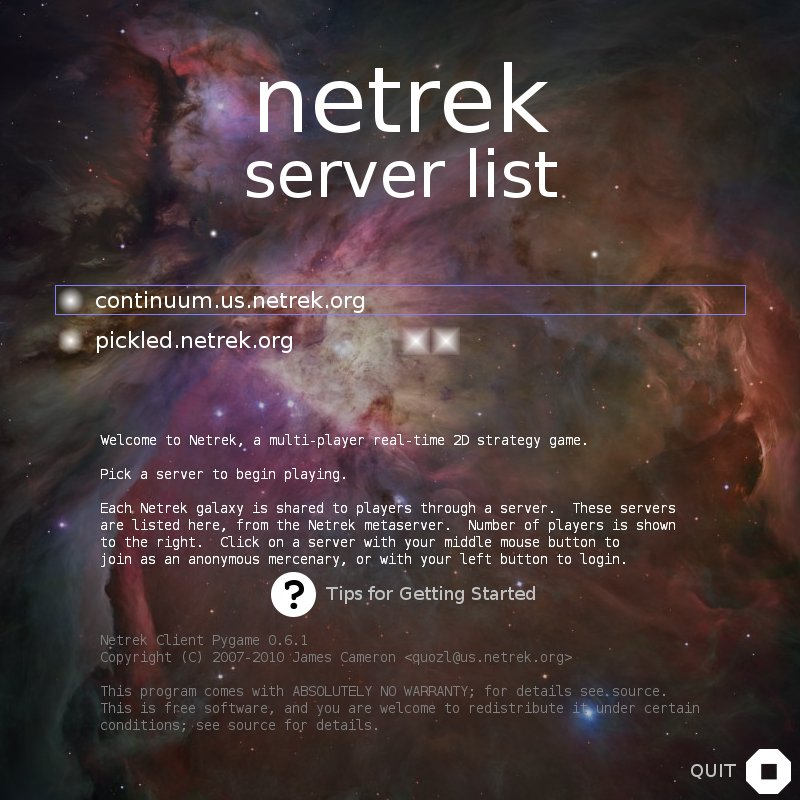

Available Netrek servers discovered via the metaserver.  Each server shows a
row of squares indicating how many players are present.  Two orbiting objects
signal a metaserver refresh.

**What to do:** left-click a server to log in, or middle-click to join as a
guest mercenary.

---

### Tips

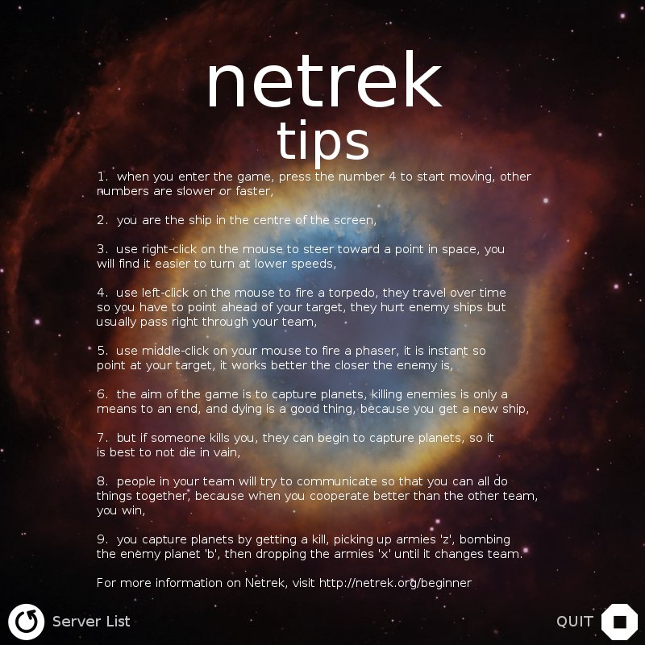

Helpful hints for new players.

**What to do:** read them, then click *Server List*.

---

### Login

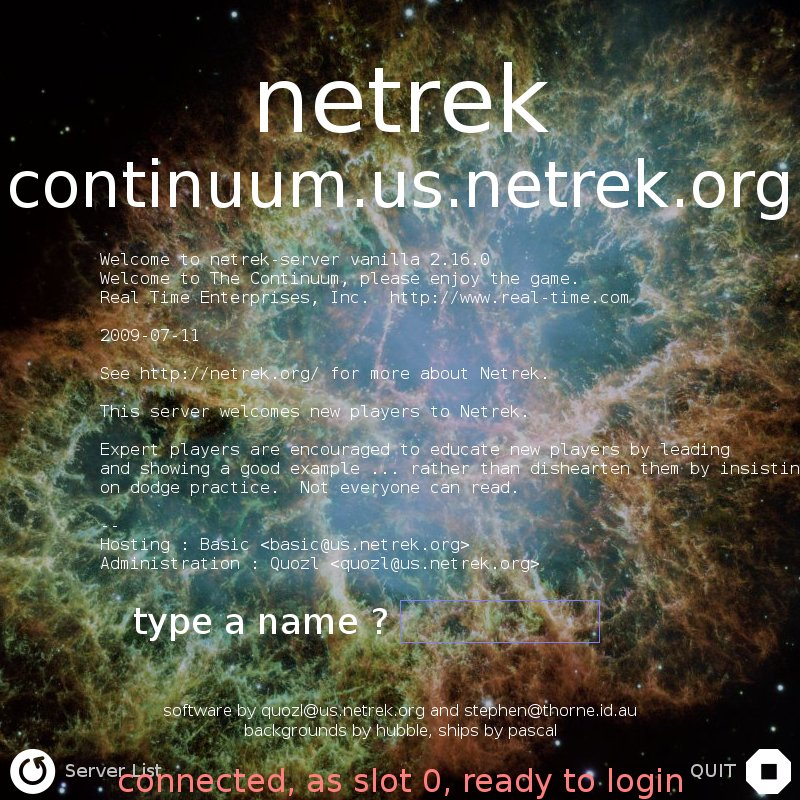

Shows the server name, message of the day, and a name prompt.

**What to do:** type `guest` and press Enter for an unrecorded session, or
enter a name and password to track your statistics.

---

### Ship and Race Selection

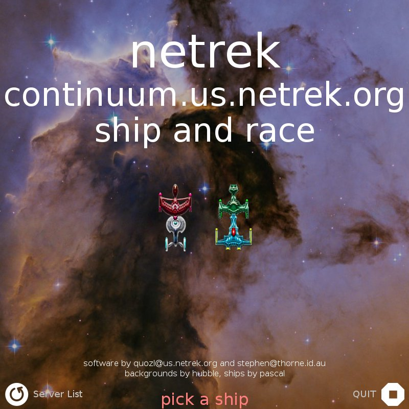

Ship and team selection.  Each team's available ship classes are shown.

**What to do:** click a ship to choose it and enter the game.  The ship
closest to the centre is the Scout Cruiser (CA), the best general-purpose
ship.  Other classes have specific strengths and weaknesses.  All ships of the
same class are equal regardless of team.

---

### Tactical View

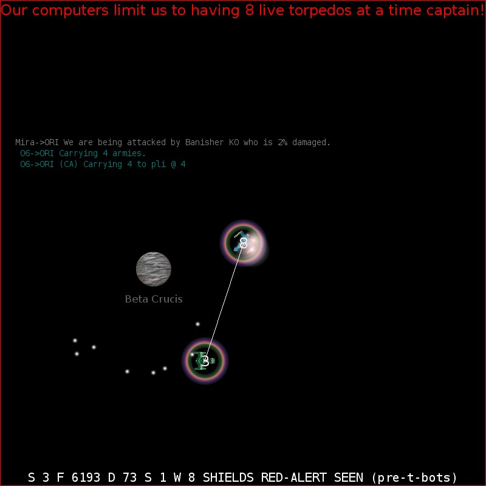

Your ship is centred.  The ring around your ship shows shields are up.

On-screen elements:
- Ship warnings in red at the top
- Game messages blended into the upper half of the screen
- An unscanned planet (team unknown) in the background
- Your ship (number 8) with two torpedo explosions and phasers firing at
  enemy ship 3
- Your torpedoes that missed flying away
- Status line: Speed, Fuel, Damage, Shields, Weapon Temperature, flags

---

### Galactic View

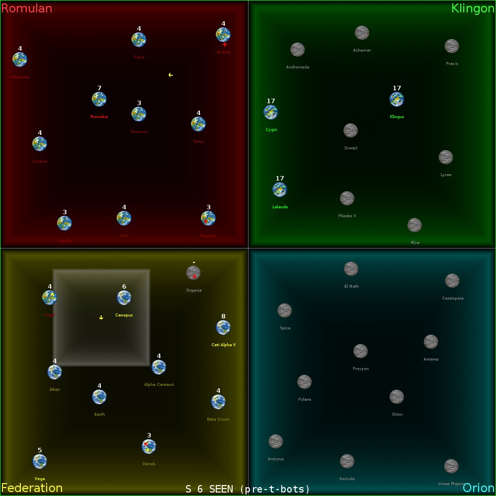

Press Enter to switch to the full galaxy view.  Your ship is inside the small
white box.  Boxed areas mark team territories; circles are planets.

- Number above each planet = armies present
- Planet name colour = owning team; bright = more than four armies (can be
  bombed or used as an army source)
- Other ships appear as small moving icons

---

### Combat and Death Sequence

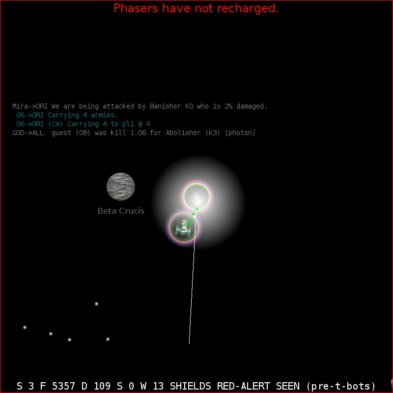

The white burst is a torpedo that pushed your damage past 100%; your ship has
begun to explode.  The coloured ring is the start of the explosion.  Green dots
are incoming enemy torpedoes.

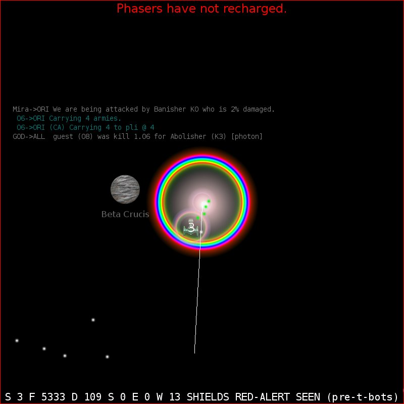

Moments later your explosion engulfs the nearby enemy ship, dealing damage
(though not always fatally).  You will return to the outfit screen and can
re-enter immediately with the spacebar.

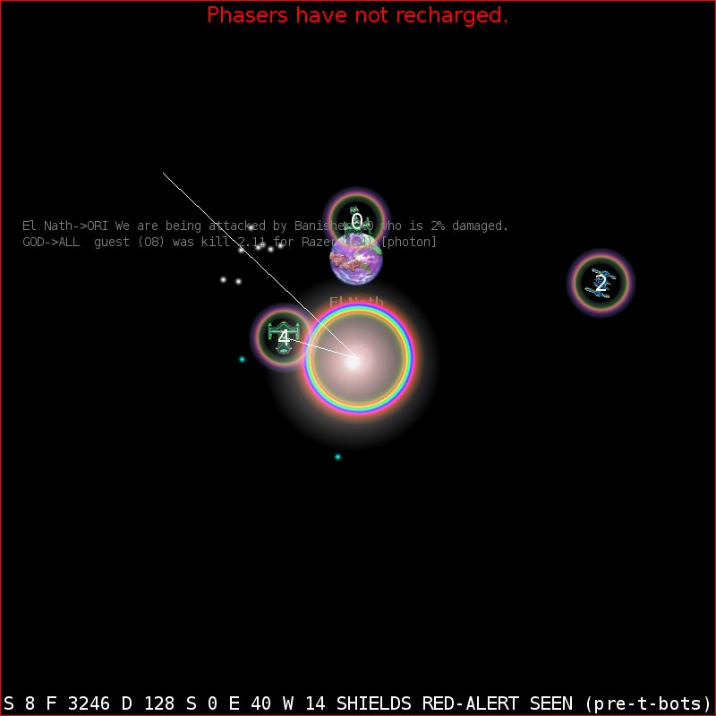

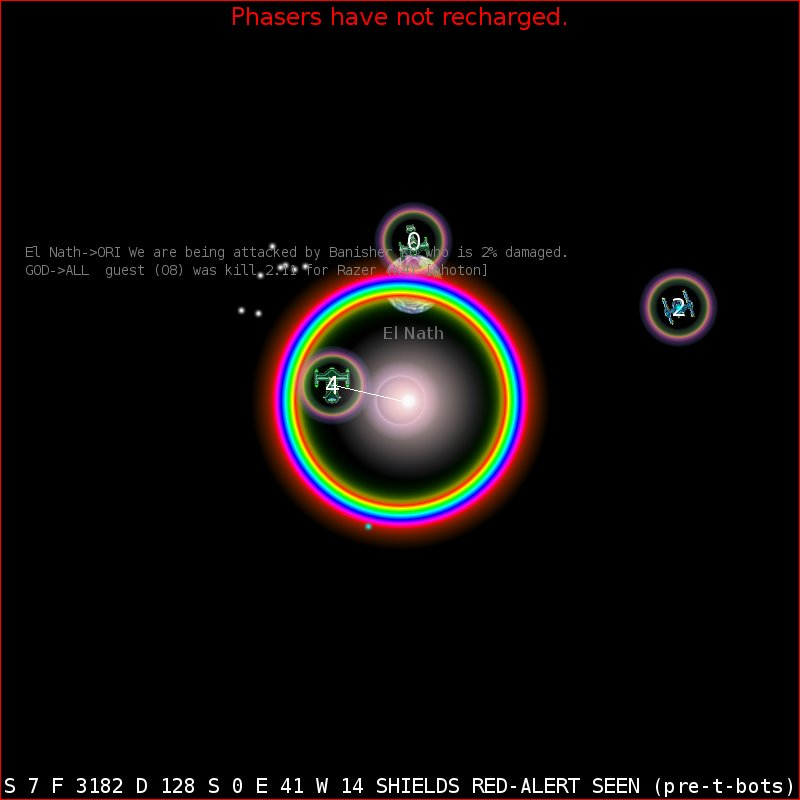

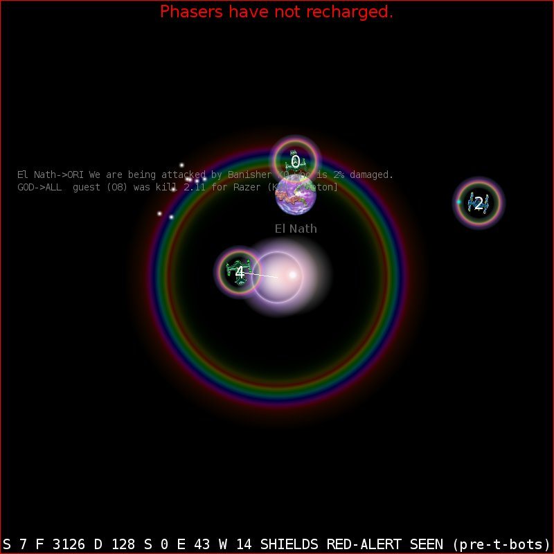

You fired a phaser that missed; enemy ship 4 killed you simultaneously with a
torpedo and a phaser.  The enemy ship is caught in the blast radius and damaged.

---

## Requirements

| Dependency | Minimum version | Notes |
|---|---|---|
| Python | 3.8 | |
| Pygame | 2.6.1 | For graphics, input, and audio |
| DejaVu fonts | any | Usually shipped with the OS |

The client connects to Netrek servers on TCP/UDP port 2592 and queries the
metaserver on UDP port 3521.

## Installation

```
git clone <repository>
cd netrek-client-pygame
# Optionally install to /usr/share/games/gytha:
make install
```

No build step is required; the package is pure Python.

## Running

```bash
python3 gytha.py                         # fullscreen, picks server from metaserver
python3 gytha.py --no-fullscreen         # windowed
python3 gytha.py -s netrek.server.org    # connect directly to a server
python3 gytha.py --name MyName --team fed
```

The splash screen appears briefly, then the server-list screen loads with live
data from the metaserver.  Click a server to connect.

---

## Controls

### Mouse

| Action | Control |
|---|---|
| Set heading | Right-click anywhere on tactical or galactic |
| Fire torpedo | Left-click |
| Fire phaser | Middle-click |
| Planet / ship info | Left-click on a planet or ship sprite |

### Keyboard — flight

| Key | Action |
|---|---|
| `1`–`9` | Set speed (1 = slow, 9 = max) |
| `0` | Stop |
| `S` | Toggle shields |
| `C` | Toggle cloak |
| `R` | Toggle repair |
| `O` | Orbit nearest planet |
| `B` | Bomb planet (must be in orbit) |
| `X` | Beam down armies |
| `Z` | Beam up armies |
| `P` | Fire plasma torpedo |
| `D` | Detonate enemy torpedoes nearby |
| `L` | Lock onto nearest planet |
| `Shift`+`F/R/K/O` | Lock onto nearest Fed/Rom/Kli/Ori planet |
| `M` | Open message composer |
| `Ctrl`+`T` | Send "I'm taking" distress |
| `Ctrl`+`E` | Send "I'll escort" distress |
| `?` or `H` | Toggle help/tips screen |
| `Q` or `Esc` | Quit |
| `Print Screen` | Save screenshot |

### Keyboard — message composer

| Key | Action |
|---|---|
| `T` / `A` / `F` / `R` / `K` / `O` | Address to Team / All / Federation / Romulan / Klingon / Orion |
| `Enter` | Send message |
| `Esc` | Cancel |

---

## Command-line options

```
-F, --fullscreen          Fullscreen mode (default)
    --no-fullscreen       Windowed mode
-s, --server HOST         Connect directly to this server
-p, --port PORT           Server port (default 2592)
    --name NAME           Character name (default: guest)
    --password PASS       Password for character name
    --login LOGIN         Username shown in player list (default: gytha)
    --team TEAM           Team to join (fed/rom/kli/ori)
    --mercenary           Auto-join the least represented team
    --ship CLASS          Ship class to request
    --updates N           Server update rate in Hz (default 10)
    --tcp-only            Disable UDP, use TCP only
    --metaserver HOST     Metaserver address (default metaserver.netrek.org)
    --metaserver-refresh-interval N
                          Seconds between metaserver polls (default 30)
    --splash-time MS      Splash screen duration in milliseconds (default 1000)
    --width W / --height H  Force a specific window resolution
    --no-backgrounds      Disable background images
    --halos               Show experimental target-distance halos
    --debug               Overlay FPS, UPS, and network statistics
    --ubertweak           Enable ubertweak mode (reduced event overhead)
    --sounds PATH         Path to sound effects directory
    --dump-server         Dump raw server packet stream to stdout
    --dump-client         Dump raw client packet stream to stdout
```

---

## Architecture (developer notes)

```
gytha.py                 Entry point — calls gytha.main()
gytha/
  __init__.py            Everything: game state, packet handlers, phases, rendering
  client.py              TCP + UDP socket management; NetworkThread
  meta.py                UDP metaserver client
  cache.py               Image (IC) and font (FC) caches; Scale2x support
  sprites.py             Pygame sprite classes: Icon, Text, Field, buttons
  bouncer.py             Parametric-orbit animation for splash screen
  cap.py                 Ship capability tables (speed, turn rate, weapons)
  constants.py           Protocol and game constants (GWIDTH, TWIDTH, team IDs…)
  options.py             argparse option definitions
  util.py                Coordinate math helpers
  motd.py                MOTD buffer and display
  rcd.py                 RCD (distress call) decoding
  sound.py               pygame.mixer sound effect loader
  mercenary.py           Automatic team selection logic
images/                  PNG/JPG sprite and background assets (180+)
sounds/                  OGG audio files
screenshots/             Screenshots used in this README
```

### Coordinate systems

| System | Range | Description |
|---|---|---|
| Netrek | 0–100,000 | Server-authoritative galaxy coordinates (GWIDTH = 100,000) |
| Tactical screen | pixels | 20,000-unit window centred on the player's ship |
| Galactic screen | pixels | Full galaxy scaled to fit the galactic panel |
| Sub-galactic | pixels | Smaller inset map variant |

### Phase (screen) lifecycle

```
PhaseSplash → PhaseServers → PhaseQueue → PhaseLogin → PhaseOutfit → PhaseFlight
                   ↕
               PhaseTips
```

Each phase owns its own event handler tables (`eh_md`, `eh_mu`, `eh_mm`,
`eh_ue`) and `display_sink_wait()` / `network_sink()` methods.  The main loop
calls `pygame.event.wait()` which blocks until either a UI event or a network
event wakes it.

### Network event loop

Network I/O runs in a dedicated background thread (`NetworkThread` in
`client.py`).  The thread blocks in `select.select()` on the TCP and UDP
sockets, dispatches packet handlers directly when data arrives, then posts a
custom `NETWORK_DATA_READY` pygame event to wake the main thread.

```
Main thread                         NetworkThread (daemon)
────────────────────────────────    ────────────────────────────────
pygame.event.wait() ←── blocks      select([tcp, udp], [], [], 0.5)
                                    ↓ data ready
                                    recv and dispatch packet handlers
                                    pygame.event.post(NETWORK_DATA_READY)
↓ woken
handle NETWORK_DATA_READY or UI event
redraw
```

This approach works on X11, Wayland, macOS, and Windows without any
platform-specific socket introspection.

---

## Building on Windows

*Originally written by Zachary Uram; updated for Python 3.*

### 1. Install Python 3

Download and install Python 3.8 or later from
[python.org](https://www.python.org/downloads/windows/).  During installation,
tick **Add Python to PATH**.

### 2. Install Pygame

```
pip install pygame
```

### 3. Get the source

Download and unpack a source release, or clone the repository:

```
git clone <repository>
cd netrek-client-pygame
```

### 4. Run

```
python gytha.py
```

### 5. Package a standalone executable (optional)

[PyInstaller](https://pyinstaller.org/) can produce a self-contained `dist/`
folder that runs without a Python installation:

```
pip install pyinstaller
pyinstaller --onedir gytha.py
```

Copy the `images/`, `sounds/`, and `screenshots/` directories into `dist/gytha/`
alongside the generated executable, then distribute the `dist/gytha/` folder or
zip it for download.

---

## Contributing

```bash
# clone
git clone <repository>
cd netrek-client-pygame

# make changes to gytha/__init__.py or other modules

# see what changed
git diff

# commit and send a pull request
git add -p
git commit -m "describe the change"
```

Packaging for Linux distributions is welcome — please open an issue or pull
request.

---

## Known issues

- UDP path failure detection is not fully implemented (`FIXME` in `client.py`).
- Approximately 30 `FIXME` comments in `__init__.py` mark incomplete features,
  including: speed display on tactical, player proximity edge pointers, unknown
  planet scanning, and moving/turning achievements on the galactic map.

## Licence

GNU General Public Licence, version 2 or later.  See `COPYING`.
